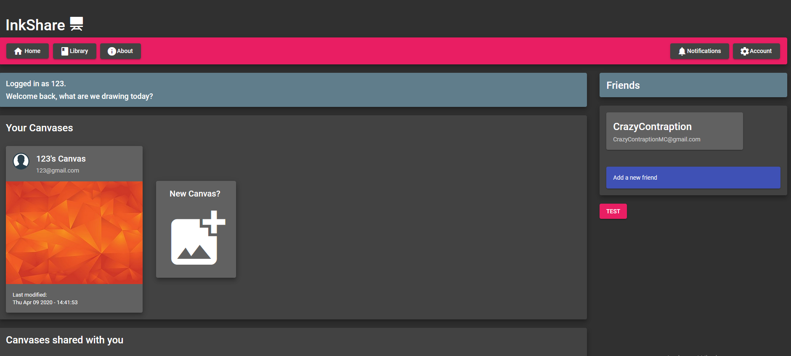
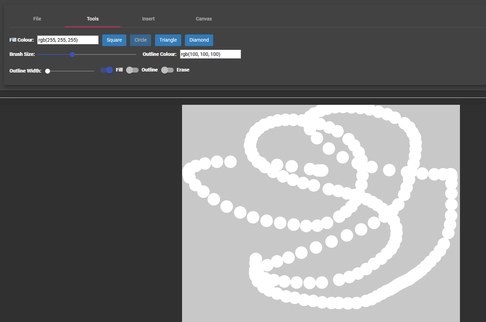

# InkShare
Realtime collaborative drawing website built with Angular and P5.js. Webservice is made with express.js, NodeJS, and MongoDB database. Realtime canvases handled using Socket.io.

##### Darien Barnard
* https://github.com/CrazyContraption
* Role: Backend and optimization programming.
##### Daniel Khan Hafner
* https://github.com/arcanine300
* Role: P5.js logic and networking functionality.
##### Timothy Morris
* https://github.com/MeisterRed
* Role: Frontend and email services.
